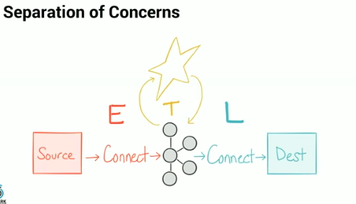
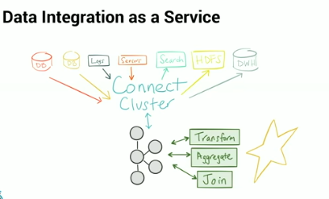

## Notes from video "Building Realtime Data Pipelines with Kafka Connect and Spark Streaming"
- video: https://databricks.com/session/building-realtime-data-pipelines-with-kafka-connect-and-spark-streaming
- spark purpose: a powerful transformation engine
  - apis make it actually useful

- kafka connect: large scale streaming data import/export for kafka
- kafka is a streaming platform: distributed pub sub and v scalable
- kafka connect doesnt really care about transformation, just copying
- ETL
  - use kafka connect for extracting from the source

  - Spark: transformations
    - then data back into kafka
  - use kafka connect again to load data into another system destination (a database?)
- input: direct kafka streams
- output: spark kafka writer
- can use sparkSQL
-  converters: used by connectors to change format

